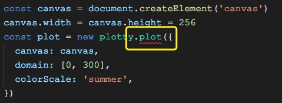

# 前端代码规范

## JavaScript / ECMAScript / JSX

### ESLint

我最初学前端的时候，经常会有这样的疑问：

我用不同的编译器（编辑器）的时候，**为什么这段代码在 WebStorm 报错，但是在 Sublime 中就没有问题？** 甚至就算写错了也没有提示。

这是因为我们写代码的时候，会有一些个人习惯，例如：缩进是用 `tab` 还是 `空格`？用空格的话是用几个？2个？四个？等等类似的问题。然而每个人如果只按照自己的习惯写，那么最后整个代码就乱成一锅粥了。所以我们需要一个规范，来统一我们的代码风格。`Lint` 就是这种工具的统称。它能检查程序中潜在的错误，以及统一代码的编写规范。

而我们今天安利的 `ESLint` 就是 `Lint` 工具的一种，是专门针对 JavaScript 而设计的。`ESLint` 能够通过复杂的配置，来实现非常自由的代码格式管理。

然而 `ESLint` 的配置太复杂了，有非常多的规则，如果人人都用自己的一套规则，那么项目还是难以管理。所以一些组织或者个人根据他们的经验总结了一些规范，例如：airbnb 规范、standard 规范、Google 规范等等。

回到我们上面的问题，会产生这样的原因是因为有些编译器（编辑器）自带了一些 `Lint` 工具，可能是 `ESLint` 、 `JSLint` 或者其他 `Lint` 工具。并且就算用同一个 `Lint` 工具也可能内置不同的规范。种种差异就导致了上面的问题。

所以我们需要安装 `ESLint`，并且选择自己喜欢的规范，来统一代码风格。我个人偏好更加宽松的 `standard` 规范。

最后附上链接：

[ESLint](http://eslint.cn/)

[airbnb 规范](https://github.com/airbnb/javascript)

[standard 规范](https://github.com/standard/standard)

[Google 规范](https://github.com/google/eslint-config-google)

## CSS / LESS

### stylelint

[stylelint](https://github.com/stylelint/stylelint) 同上面的 `ESLint` 基本相同，详细配置可以去官网查看，因为配置比较繁杂，推荐使用官方提供的规范规则。[stylelint-config-standard](https://github.com/stylelint/stylelint-config-standard)。这里有一份[示例](./.stylelint.js)。你可以复制到自己的项目根目录，并且配置相应的插件。

## editorconfig

[EditorConfig](http://editorconfig.org/) 帮助开发人员定义和维护一致的编码风格在不同的编辑器和IDE。

具体的配置规则和编辑器插件可以到 [EditorConfig](http://editorconfig.org/) 官网查看

这里有一份 [推荐配置](./.editorconfig)，你可以复制到自己的项目根目录。

`IntelliJ IDEA` `webstorm` 不用下载插件，
`ATOM` `Sublime Text` `VS Code` 需要下载插件使用，具体插件可在 [EditorConfig](http://editorconfig.org/)  官网查看。

## Project

项目相关的规范，推荐大家仔细阅读 [project-guidelines](https://github.com/wearehive/project-guidelines)，这里有详细的中文文档，我也不赘述了。

## 文档

最后推荐给大家一个网站 [印记中文](https://www.docschina.org/) ，里面有各种项目的中文文档。当然，如果你的英语足够好，还是看英文文档吧。

## 结语

前端路很长，技术更迭速度非常快，所以当你看到这些的时候，不一定这已经是当前流行的工具。本编教程只是抛砖引玉，真正要学的不是各种技术。而是自学能力。望各位共勉。
